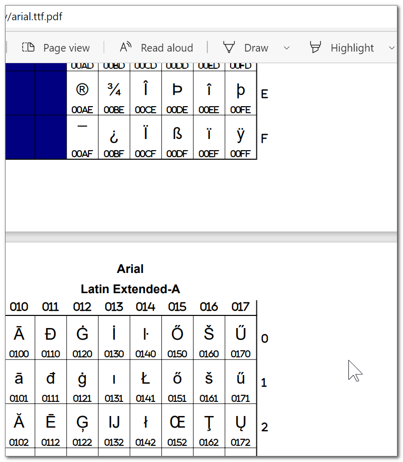
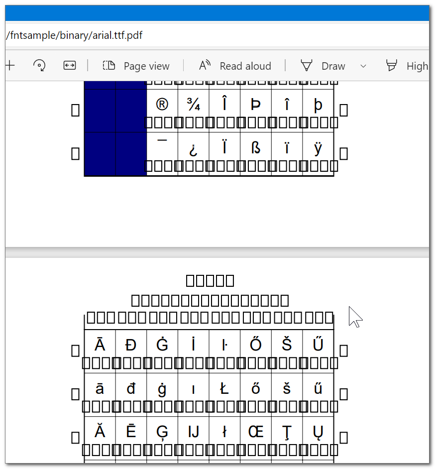

<h3> fntsample with Windows build</h3>

copy the `binary` folder anywhere you wish to,  
launch `--_font_sample.cmd` instead of `fntsample.exe`.  

there are other batch files that uses `--_font_sample.cmd` as well,  
and support drag and drop of Windows fonts directly on them,  

- `--_font_sample__font_to_pdf.cmd` that's the basic functionality.  
you need to provide a font-file as an argument, you'll get a pdf in the same folder,  
you can drop a font file over the cmd file for the same result as well, so you don't really need to even open a console/terminal or launch any command..  

- `--_font_sample__font_to_svg.cmd` will do the same but output to svg.  

- `--_font_sample__compare_two_fonts_to_pdf.cmd` - provide two fonts. you can drag and drop two fonts (at the same time) over the batch file. you'll get a pdf that shows the diff. when you select two files in windows, the one that you use to grab hold for the drag and drop action is the first argument, if it matters to you - keep that in mind, otherwise just use console to send your arguments in whatever order you wish to.  

- feel free to add more examples.


<hr/>

v2021.7.9.0 matches the lates git head https://github.com/eugmes/fntsample/commit/812bafa7e0f36c658e1da96e0faba09d1a4b129b  
it should pretty much be matching https://github.com/eugmes/fntsample/releases/tag/release%2F5.4  
with 10 extra commits

<hr/>

<br/>
<br/>
<br/>

building under cygwin x64 (amd64).


checkout https://github.com/eugmes/fntsample.git somewhere..
make a new folder 'build' under 'fntsample'

`cd fntsample/`  
`cd build/`  
`cmake .. -DUNICODE_BLOCKS=../Blocks.txt`  

```txt
-- The C compiler identification is GNU 11.3.0
-- Detecting C compiler ABI info
-- Detecting C compiler ABI info - done
-- Check for working C compiler: /usr/bin/cc - skipped
-- Detecting C compile features
-- Detecting C compile features - done
-- Found PkgConfig: /usr/bin/pkg-config (found version "1.9.3")
-- Found Intl: /usr/lib/libintl.dll.a (found version "0.21.0")
-- Checking for modules 'cairo>=1.15.4;fontconfig;freetype2;glib-2.0;pangocairo>=1.37.0;pangoft2>=1.37.0'
--   Found cairo, version 1.17.4
--   Found fontconfig, version 2.13.1
--   Found freetype2, version 24.3.18
--   Found glib-2.0, version 2.54.3
--   Found pangocairo, version 1.40.14
--   Found pangoft2, version 1.40.14
-- Found Gettext: /usr/bin/msgmerge.exe (found version "0.21")
-- Found Xgettext: /usr/bin/xgettext.exe
-- Configuring done
-- Generating done
-- Build files have been written to: /home/Elad/fntsample/build
```

`make`  

```txt
[ 11%] Building C object src/CMakeFiles/gen-unicode-blocks.dir/gen_unicode_blocks.c.o
[ 22%] Building C object src/CMakeFiles/gen-unicode-blocks.dir/read_blocks.c.o
[ 33%] Linking C executable gen-unicode-blocks.exe
[ 33%] Built target gen-unicode-blocks
[ 44%] Generating static_unicode_blocks.c
[ 55%] Building C object src/CMakeFiles/fntsample.dir/fntsample.c.o
[ 66%] Building C object src/CMakeFiles/fntsample.dir/read_blocks.c.o
[ 77%] Building C object src/CMakeFiles/fntsample.dir/static_unicode_blocks.c.o
[ 88%] Linking C executable fntsample.exe
[ 88%] Built target fntsample
[100%] Generating binary catalog uk.gmo from uk.po
[100%] Built target pofiles
```

`make install`  

```
Consolidate compiler generated dependencies of target gen-unicode-blocks
[ 33%] Built target gen-unicode-blocks
Consolidate compiler generated dependencies of target fntsample
[ 88%] Built target fntsample
[100%] Built target pofiles
Install the project...
-- Install configuration: ""
-- Installing: /usr/local/bin/fntsample.exe
-- Installing: /usr/local/share/man/man1/fntsample.1
-- Installing: /usr/local/bin/pdfoutline
-- Installing: /usr/local/bin/pdf-extract-outline
-- Installing: /usr/local/share/man/man1/pdfoutline.1
-- Installing: /usr/local/share/man/man1/pdf-extract-outline.1
-- Installing: /usr/local/share/locale/uk/LC_MESSAGES/fntsample.mo
```

copy those files,  
then try to run the exe,  
missing dlls would result with error-popup,  
copy cygwin dlls to the same folder.  

copy `/etc/fonts` folder from cygwin,  
and edit the `fonts.conf`, adding `<dir>/cygdrive/C/Windows/Fonts</dir>` and `<dir>C:/Windows/Fonts</dir>` under `<!-- Font directory list -->`,  
place fonts folder in same folder as exe,  
use a batch file to pre-set some environment variables,  
the most important is `FONTCONFIG_PATH` which will be set to `./fonts`, it does not matter you run it from Windows and you normally use backward slash, the program expects a linux-like environment and will better handle forward slash as a value.

```cmd
set "FONTCONFIG_PATH=./fonts"
```

after that, normalizing the language for the program to UTF-8 English, again with unix like environment variables that means nothing to Windows OS,  
but will be handled well by the binary (and cygwin dlls..).  

```cmd
set "LANG=en_US.UTF-8"
set "LANGUAGE=en_US"
set "LC_CTYPE=en_US.UTF-8"
set "LC_NUMERIC=en_US.UTF-8"
set "LC_TIME=en_US.UTF-8"
set "LC_COLLATE=en_US.UTF-8"
set "LC_MONETARY=en_US.UTF-8"
set "LC_MESSAGES=en_US.UTF-8"
set "LC_PAPER=en_US.UTF-8"
set "LC_NAME=en_US.UTF-8"
set "LC_ADDRESS=en_US.UTF-8"
set "LC_TELEPHONE=en_US.UTF-8"
set "LC_MEASUREMENT=en_US.UTF-8"
set "LC_IDENTIFICATION=en_US.UTF-8"
set "LC_ALL=en_US.UTF-8"
set "TZ=UTC"
```

<hr/>

the main CMD will handle all those stuff, wrapping around `fntsample.exe`,  
and other batch files will use that CMD instead of directly `fntsample.exe` for actual doing stuff..  

<hr/>


if the font folder trick wasn't applied you'll get a PDF that looks like  

  

due to some hard-coded styling that is used in the pdf itself.  

but after that fonts fix it should look fine:  

  


<hr/>

after the build,  
additional resources (icon, manifest, version information) were added to the exe after,  
those are available and rc and compiled rc (res) in 'additional_resources' folder.  
those were done mostly with https://github.com/eladkarako/manifest  
and ResourceHacker.  

the manifest was replacing the already fine embedded manifest,  
with one that has few additional optional entries that would make it run smoother on Windows 10/11.  


<hr/>

examples (results you can find under the `examples` folder):  

- `--_font_sample__font_to_pdf.cmd "NotoSansSymbols-Regular.ttf"` will generate `NotoSansSymbols-Regular.ttf.pdf`  

it is like running:  
`call "--_font_sample.cmd" "--font-file" "NotoSansSymbols-Regular.ttf" "--output-file" "NotoSansSymbols-Regular.ttf.pdf"`  


- `--_font_sample__font_to_svg.cmd "NotoSansSymbols-Regular.ttf"` will generate `NotoSansSymbols-Regular.ttf.svg`  

it is like running:  
`call "--_font_sample.cmd" "--font-file" "NotoSansSymbols-Regular.ttf" "--svg" "--output-file" "NotoSansSymbols-Regular.ttf.pdf"`  


- `--_font_sample__compare_two_fonts_to_pdf.cmd "NotoSansSymbols-Regular.ttf" "NotoSansSymbols2-Regular.ttf"` will generate `NotoSansSymbols-Regular.ttf__compared_to__NotoSansSymbols2-Regular.ttf.pdf`  

it is like running:  
`call "--_font_sample.cmd" "--font-file" "NotoSansSymbols-Regular.ttf" "--other-font-file" "NotoSansSymbols2-Regular.ttf" --output-file "NotoSansSymbols-Regular.ttf__compared_to__NotoSansSymbols2-Regular.ttf.pdf"`  


<h3>all batch files will exit with proper exit code (0 success, other code otherwise)</h3>

<br/>

<hr/>


